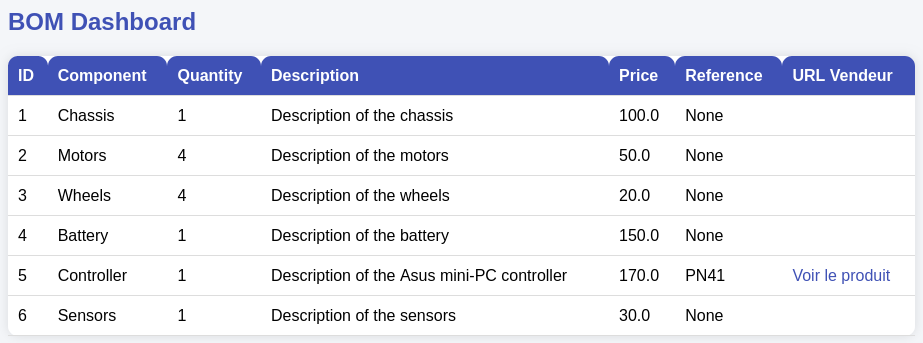

# Natural language Webdev agent

Tool used to debug prompts for a LLM coding agent. For now only tested with GPT-3.5

It allows to easily customize the full prompt, including the context sent and the function definitions sent:

It will produce dynamic web sites that interact with a SQL database:

And accept iterative instructions to improve the design:

